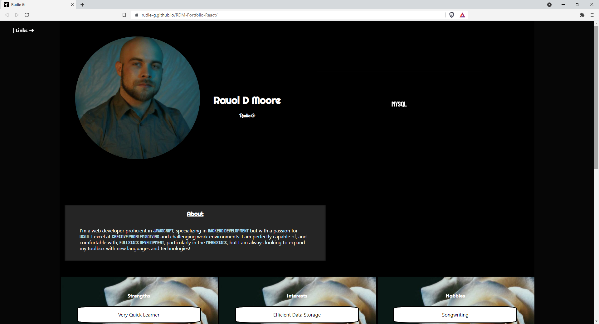

# RDM React Portfolio
 

## Description 📝 
---
A professional portfolio built using Reactjs, with custom CSS 📝

## Table of Contents  
---
- [Installation Instructions ⌨️](#installation-⌨️)
- [Usage 🖥️](#usage-🖥️)
- [Screenshot & Video 📸](#screenshot--video-📸-click-on-screenshot-to-see-video)
- [Contributors 📜](#contributors-📜)
- [Contact 📠](#contact-📠)
- [License 📋](#license-📋)

## Installation ⌨️ 
---
visit the deployed application at rudie-g.github.io/RDM-Portfolio-React ⌨️
  
## Usage 🖥️ 
---
the deployed app allows a user to view information about me, some sample projects, as well as links to my LinkedIn and Github 🖥️
  
## Contributors 📜 
---
Rudie G (sole author) 📜
  
## Screenshot 📸 
---
 
 
 

## Contact 📠 
---
 
GitHub: https://github.com/rudie-g
 
 
Email: rauoldm@gmail.com
 
 

## License 📋

---
 
This application is covered by <a href="https://opensource.org/licenses/BSD-3-Clause"> 3-clause BSD License</a>
